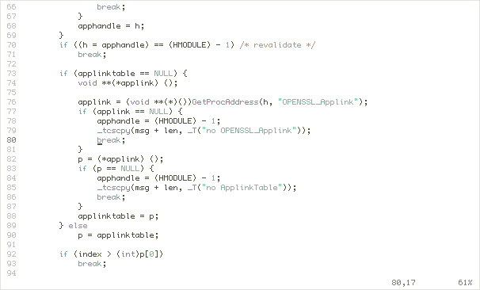
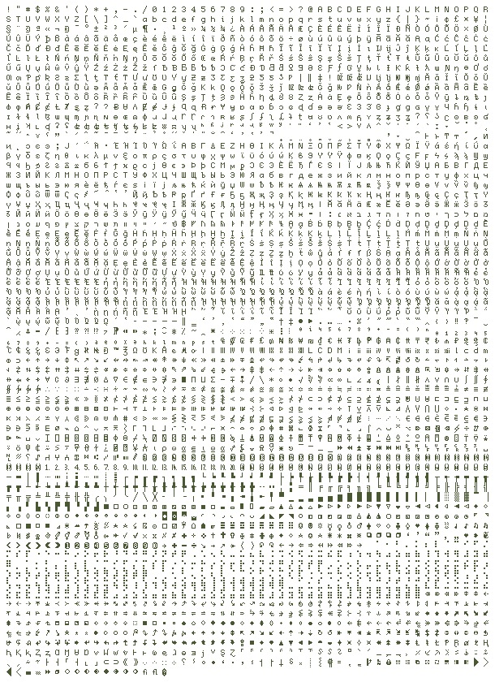
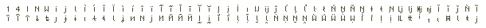
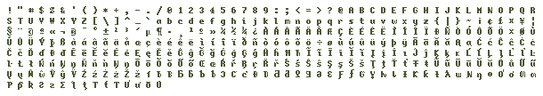

> This repo is a **mirror** of the [tewi font repository](https://github.com/lucy/tewi-font) by [lucy](https://github.com/lucy). Everything is the same as the original repository except for these first two lines in the `README` and the screenshots in the `assets` folder, which were previously hosted on GitHub pages.

> **NOTE**: The distro packages listed in `Installing` will no longer work as they are pointed at the original repository.



#### tewi-medium


#### tewii-medium


#### tewi2a-medium


#### tewi-bold


#### tewii-bold


#### tewi2a-bold


## Building
#### Requirements
* python 3 (variant generator)
* bdftopcf (.pcf files)

Run `make` to build PCFs. To only build the standalone BDF files run `make var`.

## Installing
#### Arch
[AUR package](https://aur.archlinux.org/packages/bdf-tewi-git/)

#### Crux
[6c37/pcf-tewi](https://github.com/6c37/crux-ports)

#### X11
```shell
$ make fontdir
$ xset +fp /path/to/tewi-font/out # you should do this every time X starts
                                  # e.g. put it in your ~/.xinitrc
```

#### Fontconfig
```shell
$ make
$ ln -s /path/to/tewi-font/out ~/.fonts/tewi
$ fc-cache -fv
```

NOTE: If your distro has a file like `70-no-bitmaps.conf` in
`/etc/fonts/conf.d`, and tewi doesn't work, you should remove it.
